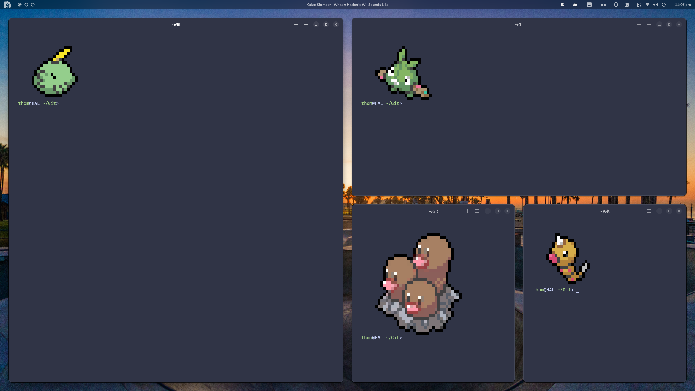

# GNOME Styling - My Way

I love GNOME desktop, but consistent styling can be difficult.\
It is important that I am able to switch between dark and light mode.



### Requirements

[GNOME Desktop](https://www.gnome.org/) (obviously)\
[Gradience](https://github.com/GradienceTeam/Gradience)\
[Night Theme Switcher](https://extensions.gnome.org/extension/2236/night-theme-switcher/)

### Adwaita Colours

Choose your desired light and dark theme within Gradience, and begin by first applying your light theme.\
Navigate to `$HOME/.config/gtk-3.0` and rename `gtk.css` to `gtk-light.css`.\
Navigate to `$HOME/.config/gtk-4.0` and rename `gtk.css` to `gtk-light.css`.\
Return to Gradience and apply your dark theme.\
Navigate to `$HOME/.config/gtk-3.0` and create a copy of `gtk.css`, renaming it to `gtk-dark.css`.\
Navigate to `$HOME/.config/gtk-4.0` and create a copy of `gtk.css`, renaming it to `gtk-dark.css`.

Now we write an alias in order to switch our theme from light to dark with a single command.\
Create these two aliases for your shell -
```
alias light-mode="gsettings set org.gnome.desktop.interface color-scheme 'default' &&
                    cd .config/gtk-3.0 && rm gtk.css &&
                    ln -s gtk-light.css gtk.css &&
                    cd ../gtk-4.0 && rm gtk.css &&
                    ln -s gtk-light.css gtk.css &&
                    cd"
alias dark-mode="gsettings set org.gnome.desktop.interface color-scheme 'prefer-dark' &&
                    cd .config/gtk-3.0 && rm gtk.css &&
                    ln -s gtk-dark.css gtk.css &&
                    cd ../gtk-4.0 && rm gtk.css &&
                    ln -s gtk-dark.css gtk.css &&
                    cd"
```

(These following commands are using the bash shell as an example)\
Now we go to the Night Theme Switcher extension settings.\
Select the Commands header, and for Sunrise enter `bash -c light-mode`.\
And for Sunset enter `bash -c dark-mode`.
