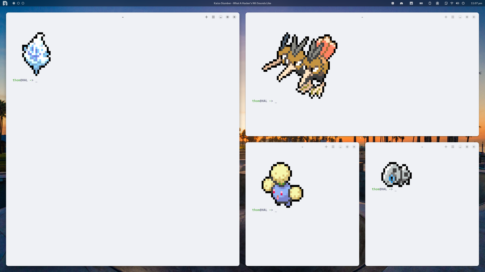

# GNOME Styling - My Way

I love GNOME desktop, but consistent styling when using my own theme can be difficult, sometimes even with Gradience.\
It is important that I am able to switch between dark and light mode.



### Requirements

[GNOME Desktop 44](https://www.gnome.org/)\
[Gradience](https://github.com/GradienceTeam/Gradience)\
[Night Theme Switcher](https://extensions.gnome.org/extension/2236/night-theme-switcher/)

### Adwaita Colours

Choose your desired light and dark theme within Gradience, and begin by first applying your light theme.\
Navigate to `$HOME/.config/gtk-3.0` and rename `gtk.css` to `gtk-light.css`.\
Navigate to `$HOME/.config/gtk-4.0` and rename `gtk.css` to `gtk-light.css`.\
Return to Gradience and apply your dark theme.\
Navigate to `$HOME/.config/gtk-3.0` and create a copy of `gtk.css`, renaming it to `gtk-dark.css`.\
Navigate to `$HOME/.config/gtk-4.0` and create a copy of `gtk.css`, renaming it to `gtk-dark.css`.

Our goal is to switch from light to dark with a single command.\
I'm using functions in Fish shell, but it should be pretty easily adaptable -
```
## Light and Dark Mode
# Function for Light Mode
function light-mode
    # Change Gnome dconf setting to 'light mode'
    gsettings set org.gnome.desktop.interface color-scheme "default"
    # Using the Flatpak version of Gradience, apply the Catppuccin light theme
    flatpak run --command=gradience-cli com.github.GradienceTeam.Gradience apply -n "Catppuccin Latte" --gtk both
    # Ensure Flatpaks are themed correctly (I'm using a matching theme in my ~/.themes directory)
    sudo flatpak override --env=GTK_THEME=Catppuccin-Latte-Standard-Peach-Light
    # Set the VS Code theme as well
    sed -i -e 's/"workbench.colorTheme": ".*"/"workbench.colorTheme": "Catppuccin Latte"/g' "$HOME/.config/Code/User/settings.json"
    # Also set the corresponding theme icons in VS Code
    sed -i -e 's/"workbench.iconTheme": "".*"/"workbench.iconTheme": "catppuccin-latte"/g' "$HOME/.config/Code/User/settings.json"
end

# Function for Dark Mode
function dark-mode
    # Gnome settings dark mode
    gsettings set org.gnome.desktop.interface color-scheme "prefer-dark"
    # Use gradience-cli to apply our dark theme
    flatpak run --command=gradience-cli com.github.GradienceTeam.Gradience apply -n "Catppuccin Frappé" --gtk both
    # Apply corresponding theming to Flatpaks
    sudo flatpak override --env=GTK_THEME=Catppuccin-Frappe-Standard-Peach-Dark
    # Change VS Code theme
    sed -i -e 's/"workbench.colorTheme": ".*"/"workbench.colorTheme": "Catppuccin Frappé"/g' "$HOME/.config/Code/User/settings.json"
    # Change VS Code icons
    sed -i -e 's/"workbench.iconTheme": "".*"/"workbench.iconTheme": "catppuccin-frappe"/g' "$HOME/.config/Code/User/settings.json"
end
```

Now we can go to the Night Theme Switcher extension settings.\
Select the Commands header, and for Sunrise enter `bash -c light-mode`.\
And for Sunset enter `bash -c dark-mode`.

### More Reading

[gradience-cli](https://github.com/GradienceTeam/Gradience/wiki/Using-CLI).\
[adw-gtk3](https://github.com/lassekongo83/adw-gtk3).\
[catppuccin 😍](https://github.com/catppuccin/gtk)
